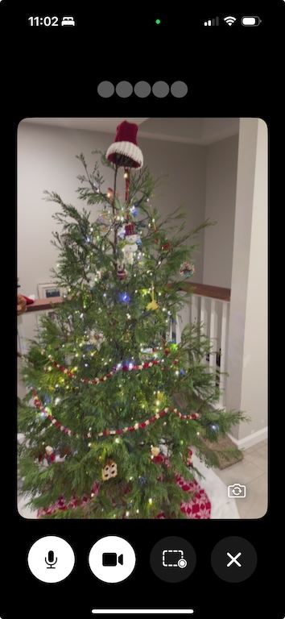

> [!WARNING]
> This example is outdated. While it still works great, we've now added built-in vision support to a whole set of new [frontend starter apps](https://docs.livekit.io/agents/start/frontend/#starter-apps) for every platform and [live video](https://docs.livekit.io/agents/build/vision/#video) is easy to add to the [Python agent starter](https://github.com/livekit-example/agent-starter-python) repository for the latest example.

# LiveKit Vision Demo

This LiveKit sample app shows a voice AI assistant with realtime audio and video input.

It contains a native iOS frontend, built on LiveKit's [Swift SDK](https://github.com/livekit/client-sdk-swift), and a backend agent, built on LiveKit's [Python Agents framework](https://github.com/livekit/agents) and the [Gemini Live API](https://ai.google.dev/gemini-api/docs/live).



# Features

### Real-time Video & Audio
- 📱 Front and back camera support
- 🎙️ Natural voice conversations
- 🖥️ Live screen sharing

### Background Support
- 🔄 Continues running while using other apps
- 💬 Voice conversations in background
- 👀 Screen monitoring while multitasking

The assistant can observe and interact with you seamlessly, whether you're actively using the app or working on other tasks.

# Agent Architecture

The backend agent is built on the [MultimodalAgent](https://docs.livekit.io/agents/voice-agent/multimodal/) class hooked up to the Gemini Live API.

Video frames are sampled at 1 frame per second while the user speaks, and 0.3 frames per second otherwise. Images are sent as JPEG at 1024x1024 max size.  For more information on video input, see the LiveKit Agents [vision docs](https://docs.livekit.io/agents/voice/vision#video).

# Running Locally

This project is meant to be a starting point for your own project, and is easy to run locally.

## Running the Agent

### Prerequisites

- [LiveKit Cloud](https://cloud.livekit.io) project
- [Google Gemini API Key](https://console.cloud.google.com/apis/library/generativelanguage.googleapis.com)
- Python 3

### Setup

Put your LIVEKIT_URL, LIVEKIT_API_KEY, LIVEKIT_API_SECRET, GOOGLE_API_KEY into a file called `agent/.env`.

Then install dependencies

```bash
cd agent
python -m venv .venv
source .venv/bin/activate
pip install -r requirements.txt
```

Finally, run the agent with:

```bash
python main.py dev
```

## Using the Agents Playground

This project is fully compatible with LiveKit's [Agents Playground](https://agents-playground.livekit.io), so you can easily test the agent in your browser without having to build the iOS app. Just go to the playground, pick your cloud project, and connect! There is a checkbox to "Enable camera" if you wish to share your camera feed with the agent.

## Running the iOS App

This project includes a sample iOS app that you can build yourself.

### Prerequisites

- Xcode 16
- Device with iOS 17+ (simulator is not supported)
- [LiveKit Cloud](https://cloud.livekit.io) project
- A [Sandbox](https://docs.livekit.io/cloud/sandbox/) [token server](https://cloud.livekit.io/projects/p_/sandbox/templates/token-server)

### Setup

1. Open `swift-frontend/VisionDemo/VisionDemo.xcodeproj` in Xcode.
2. Create a file `swift-frontend/VisionDemo/Resources/Secrets.xcconfig` with `LK_SANDBOX_TOKEN_SERVER_ID=` and your token server's unique ID.
3. Edit the bundle identifier for the `VisionDemo` target to a suitable values for your own use.
4. Edit the bundle identifier for the `BroadcastExtension` to `<your-bundle-identifier>.broadcast`.
4. Create a new App Group called `group.<your-bundle-identifier>` and select it in the "Signing & Capabilities" section of the `VisionDemo` target.
7. Build and run the app on your device.

# Self-Hosted Options

This project is built with the LiveKit Cloud [Sandbox token server](https://cloud.livekit.io/projects/p_/sandbox/templates/token-server) to make token generation easy. If you want to self-host or run a local LiveKit instance, you'll need to modify `swift-frontend/VisionDemo/Services/TokenService.swift` file to fetch your token from your own server and remove the `noise-cancellation` plugin from the agent ([enhanced noise cancellation](https://docs.livekit.io/cloud/noise-cancellation/) is a LiveKit Cloud feature).
